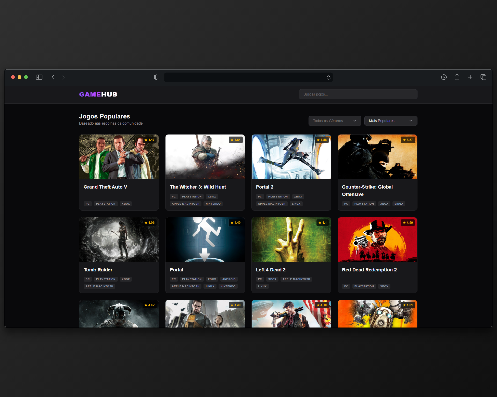
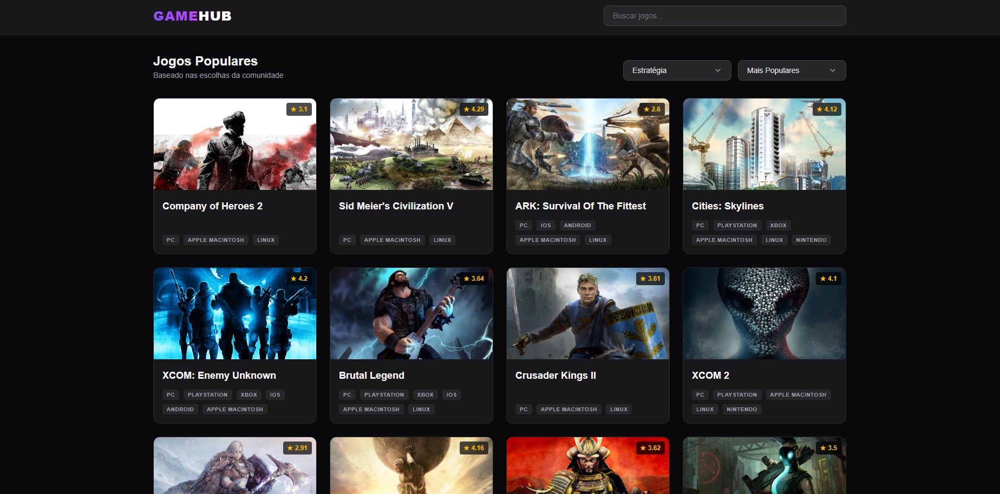
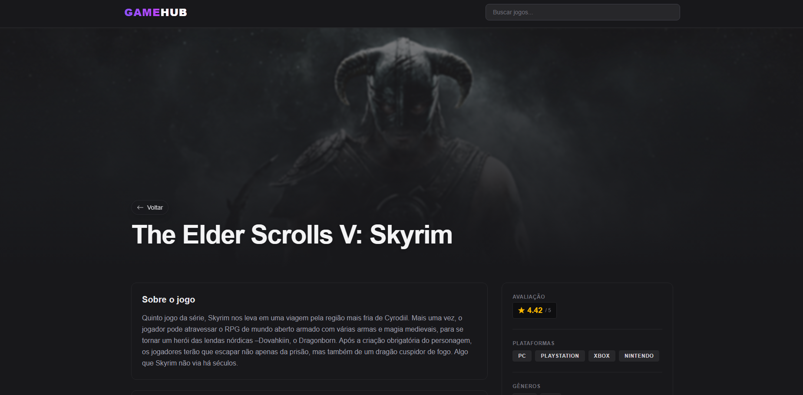
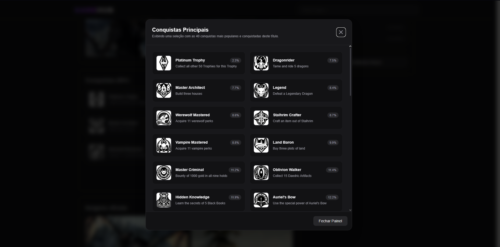

# 🎮 GameHub

<p align="center">
  Plataforma moderna para descoberta, pesquisa e exploração de jogos eletrônicos.
</p>

<p align="center">
  
</p>

<p align="center">
  
  
  
  
  
</p>

---

## 📖 Sobre o Projeto

O **GameHub** é uma plataforma web desenvolvida para centralizar informações sobre jogos eletrônicos em uma interface moderna, intuitiva e responsiva.

A aplicação consome dados de múltiplas APIs especializadas para fornecer uma experiência completa de descoberta de jogos, permitindo que os usuários pesquisem títulos, visualizem trailers oficiais, consultem informações detalhadas, acompanhem conquistas e explorem galerias de imagens de forma rápida e organizada.

O projeto foi construído com foco em performance, experiência do usuário e escalabilidade, adotando boas práticas do ecossistema React e arquitetura baseada em separação de responsabilidades.

---

## ✨ Funcionalidades

### 🏠 Página Inicial

- Catálogo dinâmico dos jogos mais populares.
- Sistema de pesquisa em tempo real.
- Filtros por gênero.
- Ordenação personalizada.
- Paginação inteligente.
- Persistência de filtros através da URL.

### 🎮 Página de Detalhes

- Ficha técnica completa do jogo.
- Informações sobre plataformas, desenvolvedores e publicadoras.
- Links para aquisição do título.
- Tradução automática das descrições para Português (PT-BR).
- Trailer oficial integrado através da API do YouTube.
- Galeria com até 4 screenshots oficiais.
- Sistema de conquistas com estatísticas de desbloqueio.
- Modal dedicado à visualização de até 40 conquistas disponibilizadas pela API.
- Preservação do histórico de navegação e filtros da página inicial.

---

## 🚀 Destaques Técnicos

### 🔄 Integração com Múltiplas APIs

O GameHub consolida informações provenientes de diferentes serviços externos para entregar uma experiência rica e completa ao usuário.

### 🌎 Tradução Automática

As descrições dos jogos são convertidas automaticamente para Português (Brasil), tornando o conteúdo mais acessível para usuários brasileiros.

### ⚡ Requisições Paralelas

Utilização de `Promise.all()` para executar múltiplas requisições simultaneamente, reduzindo significativamente o tempo de carregamento das páginas.

### 🔗 Persistência de Estado na URL

Filtros, buscas e ordenações são armazenados na URL através do `useSearchParams`, permitindo compartilhamento de links e preservação de estado após atualização da página.

### 🧩 Arquitetura Escalável

Separação clara entre componentes, páginas, hooks e serviços para facilitar manutenção e evolução do projeto.

---

## 🛠️ Tecnologias Utilizadas

### Front-End

- React.js
- Vite
- Tailwind CSS
- React Router DOM
- React Icons
- Axios

### APIs

- RAWG API
- YouTube Data API
- Serviço de Tradução

---

## 📂 Estrutura do Projeto

```text
src/
│
├── assets/
├── components/
├── hooks/
├── pages/
├── routes/
├── services/
├── utils/
└── App.jsx
```

---

## 🏗️ Arquitetura

O projeto segue princípios de desenvolvimento escalável e manutenção simplificada.

### Service Layer

Responsável pela comunicação com APIs externas.

```javascript
/services
```

### Custom Hooks

Grande parte da lógica da aplicação foi abstraída para Custom Hooks, responsáveis por funcionalidades como busca de jogos, carregamento de detalhes, obtenção de trailers, listagem de conquistas e recuperação de jogos relacionados. Essa arquitetura mantém os componentes focados na renderização da interface e melhora a organização do código.

### URL State Management

Os filtros de busca, gênero, ordenação e paginação são sincronizados com a URL através do React Router. Isso permite compartilhar links contendo exatamente o estado atual da aplicação, além de preservar filtros e pesquisas após atualizações da página.

---

## 🔑 Variáveis de Ambiente

Crie um arquivo `.env` na raiz do projeto:

```env
VITE_RAWG_API_KEY=YOUR_API_KEY
VITE_YOUTUBE_API_KEY=YOUR_API_KEY
```

---

## 💻 Instalação

Clone o repositório:

```bash
git clone https://github.com/viniciusfelixmatos/gamehub
```

Acesse a pasta:

```bash
cd gamehub
```

Instale as dependências:

```bash
npm install
```

Execute o projeto:

```bash
npm run dev
```

Gerar build de produção:

```bash
npm run build
```

Visualizar build:

```bash
npm run preview
```

---

## 📸 Demonstração

### 🏠 Página Inicial



Interface principal da aplicação com catálogo dinâmico, sistema de busca, filtros e paginação.

### 🎮 Página de Detalhes



Visualização completa das informações do jogo, incluindo descrição traduzida, trailer oficial, screenshots e dados técnicos.

### 🏆 Sistema de Conquistas



Modal dedicado à exibição das conquistas do jogo, apresentando nome, descrição e percentual de jogadores que desbloquearam cada conquista. São exibidas até 40 conquistas por jogo, limite definido pela API utilizada para obtenção dos dados.

## 🎯 Roadmap

- [ ] Sistema de favoritos
- [ ] Perfil de usuário
- [ ] Login social
- [ ] Recomendações personalizadas
- [ ] Histórico de navegação
- [ ] Comparação entre jogos
- [ ] Modo escuro

---

## 🤝 Contribuição

Contribuições são bem-vindas.

```bash
git checkout -b feature/minha-feature
git commit -m "feat: nova funcionalidade"
git push origin feature/minha-feature
```

Abra um Pull Request para análise.

---

## 👨‍💻 Autor

**Vinicius Douglas Felix de Matos**

Desenvolvedor Front-End especializado em React, JavaScript e TypeScript, com conhecimentos em desenvolvimento Back-End utilizando PHP, Laravel e bancos de dados relacionais.

GitHub: https://github.com/viniciusfelixmatos

LinkedIn: https://www.linkedin.com/in/vinicius-matos-275884267/

Portifolio: https://portifolio-peach-iota.vercel.app

---

## 📄 Licença

Este projeto está licenciado sob a licença MIT.
